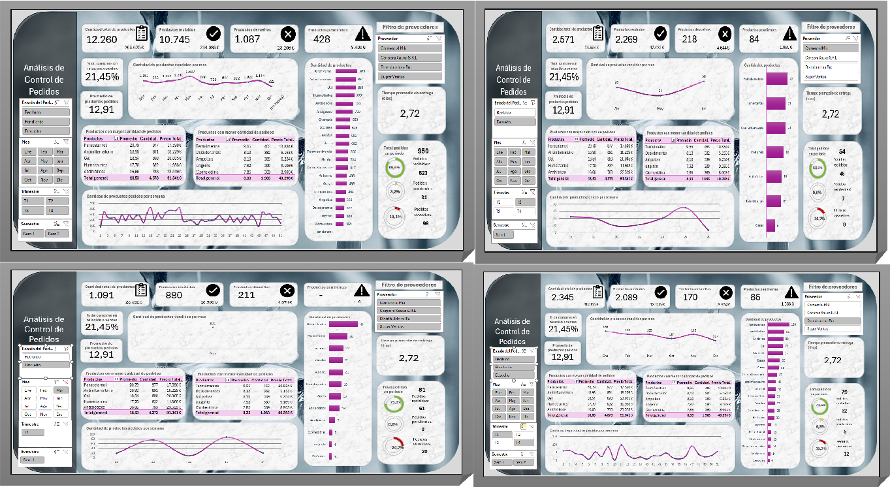
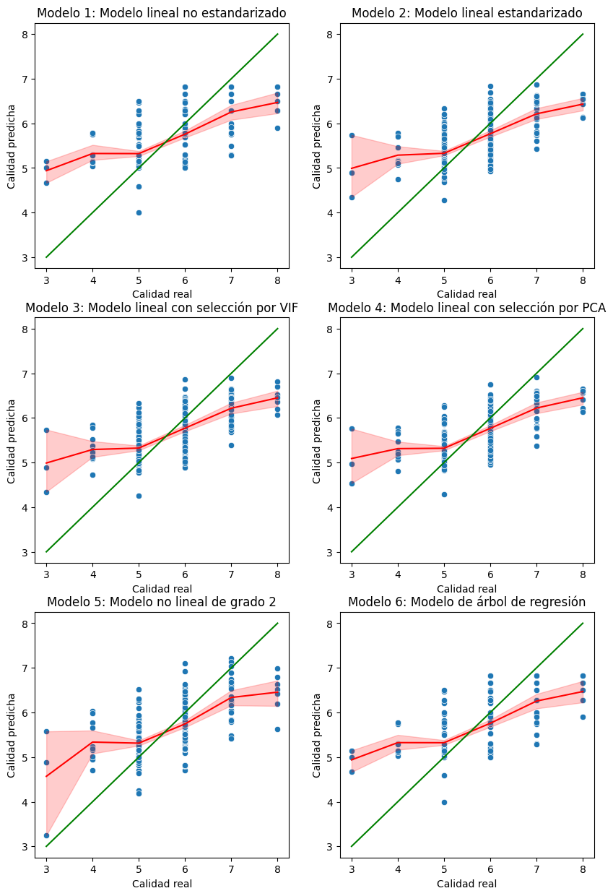
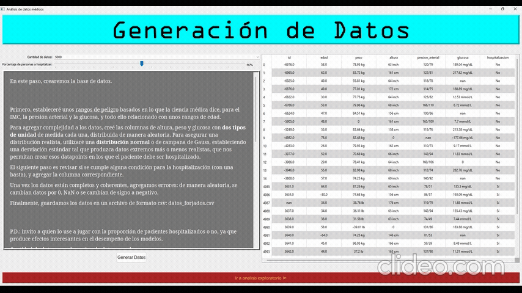
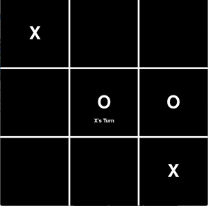

# Selected Projects

⭐ Featured
    <a href="/projects/machine-learning-desktop-application.html">Machine Learning Desktop Application</a>

## Data Analysis

    ExtraaLearn
    Wine Quality
    Excel dashboards

## Python & Software

    Python Desktop Application
    ...

## Web Development

    ...

## Experiments & Fun

    Games

## Education projects

### Great Learning student project: online school analysis

### Business analysis dashboard in Excel

_*Please download the file and run it on Excel, it won't work properly on Google Sheets._

### Wine quality study

### Desktop app for synthetic data creation and analysis

<a href="https://github.com/Vaelico333/Proyecto-final-machine-learning-en-Deusto">_GitHub repository for source code_</a>

---

## Work projects

- [Soon](https://www.youtube.com/watch?v=dQw4w9WgXcQ)

---

## Fun projects

---

## Proyecto final ML en Deusto -> PROMOCIONAR

## Proyecto final Python en Deusto

## Excel Dashboard: global music streaming (https://github.com/Vaelico333/Excel_Dashboard/blob/main/Global_Music_Streaming_Listener_Preferences.csv)

## Excel dashboard: pedidos (D:\thePower\Dashboard+guiado+Excel\Dashboard_1.xlsx) -> CREAR REPOSITORIO

## Excel dashboard: Netflix ("D:\thePower\EDA+con+Excel\BBDD_Usiarios_Netflix_jun.xlsm") -> CREAR REPO

## Google sheets dashboard: perfumes (https://docs.google.com/spreadsheets/d/13H6jlL5q8THAymECVlUGRbaSOid6pj7PxMjE-JGyV0s/edit?usp=drive_link)

## Google sheets dashboard: telecomunicaciones (https://docs.google.com/spreadsheets/d/1NiCbn9hxk-UBleZgCb4KTxXYC5ve5bipirudZv7pRvQ/edit?usp=drive_link)